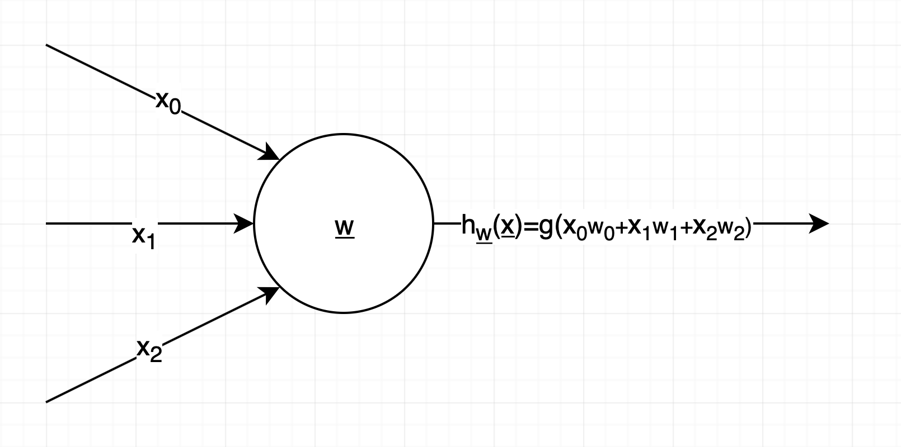
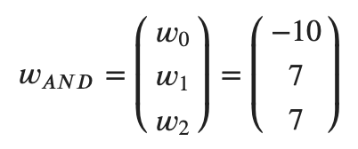
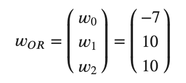
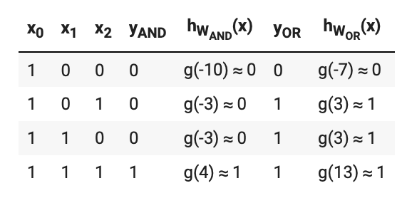

<a href="README.md">Tartalom</a>

# Egyszerű neurális hálózatok építése Pythonban

Ebben a cikkben egyszerű neurális hálózatokat építek Python nyelven. A feladathoz kizárólag a következő Python könyvtárakat használom: `numpy`, `tqdm`.

Az itt bemutatott neurális hálózatok egyszerű boolean függvényeket modelleznek. Kitérek arra, hogy 1 db neuronnal milyen boolean függvényeket lehet megvalósítani.

# Bevezető

Jelen cikknek nem célja, hogy általános alapfogalmakkal ismertesse meg az olvasót a mesterséges intelligenciával, gépi tanulással, neurális hálózatokkal, mély tanulással kapcsolatban. A referenciákban felsorolt szakirodalomban alaposan lehet tájékozódni ezekben a témákban. 

A cikkben implementált neurális hálózatok logikai függvényeket valósítanak meg. Az egyszerű logikai `ÉS` illetve `VAGY` függvénytől kiindulva az összetettebb függvényekig. Látni fogjuk, hogy egyetlen neuronnal mit lehet megvalósítani, és mi az, amihez már több neuronból álló hálózat szükséges.

A cikk tartalmának értelmezéséhez a következő alapfogalmak ismerete szükséges, ezekkel csak érintőlegesen foglalkozom ebben a cikkben:

- neurális hálózat

- tanítási fázis

- előreterjesztés (feed forward)

- hiba-visszaterjesztés (backpropagation)

- gradiensereszkedés (gradient descent)

- aktivációs függvény (activation function)

- szigmoid függvény / logisztikai függvény (sigmoid function / logistic function)

- súlyok (weights)

- predikció (prediction)

- hipotézis függvény (hypothesis function)

- tanulási ráta (learning rate)

- vektor (vector)

- mátrix (matrix)

- alapvető lineáris algebrai ismeretek

# Egyetlen neuron 

Az általam használt egyszerű mesterséges neuron modellje az alábbi ábrán látható. Három bemeneti változója van, de igazából csak kettő az, ami a valós bemenő adatokat tartalmazza, az x0 változó mindig 1-es értéket tartalmaz. A neuron által adott predikció a bemenő értékek, és a súlyok szorzata, ami egy lineáris függvényt ad, majd ennek eredményére a szigmoid függvény van alkalmazva, mint aktivációs függvény.

Az alábbi ábrán egyszeres aláhúzás jelöli a vektor típusú változókat (sorvektorokat és oszlopvektorokat).

A bemeneti adatokat `x`-szel jelölöm:

")

A súlyokat, jelen esetben egy vektort, `w` jelöli.

")

A hipotézis függvény `h`, vagyis ami a neurális hálózat kimenet egy adott `x` bemenetre, `w` súlyok mellett:

 = g(wx) = g(x0w0+x1w1+x2w2)")

A szigmoid függvény, `g`:

Ha például a logikai `ÉS` műveletet szeretnénk megvalósítani, akkor intuitív módon felírhatunk egy olyan súlyvektort, amivel a neurális hálózat, ami jelen esetben csak egyetlen neuronból áll, kb. az `ÉS` műveletnek megfelelő eredményt ad a kimenetén. Hasonlóan járhatunk el más logikai műveletekkel is. Az alábbi ábrán a logikai `ÉS` és `VAGY` művelet egy neuronnal történő megvalósításához tartozó súlyokat láthatjuk. Érdemes észrevenni, hogy ha megfordítom a súlyok előjelét, akkor a végeredmény negáltját kapom, tehát így megvan további két függvény implementációja.

Az `ÉS` és a `VAGY` függvény igazságtáblája, és a neurális hálózat kimenete, ha az előbbi súlyokat használjuk:

# Egyszerű neuron implementációja

Az alábbi példaprogram egyetlen neuron tanítását valósítja meg. A gradiensereszkedést (gradient descent) használom, de a hibafüggvény parciális deriválása helyett egy közelítést alkalmazok a jól ismert módszerrel.

1. *inicializálás*: véletlenszerű kezdő súly értékek beállítása

2. *előreterjesztés (feed forward)*: kiszámolom a neuron kimeneteit minden egyes bemenetre.

")

3. *hiba-visszaterjesztés (backpropagation)*: A hibafüggvény (amit J jelöl) aktuális értéke az aktuális súlyoktól függ. Ha az i. súlyt kicsit változtatom (egy kis számot hozzáadok, illetve egy kis számot kivonok belőle), ki tudom számolni, hogy mennyit változik a hibafüggvény értéke, ha a többi súlyt változatlanul hagyom. Ebből ki tudom számolni, hogy megközelítőleg mekkora a hibafüggvény meredeksége az. i. súly mentén, ha a többi súly változatlanul marad. Tehát tulajdonképpen a hibafüggvény parciális deriváltját számítom ki megközelítőleg. Ezekből a parciális deriváltakból összeállítok egy oszlopvektort. Az oszlopvektor sorainak száma megegyezik a súlyok számával, vagyis a bemenő változók számával (jelen esetben 3). A kiszámolt vektort megszorzom a tanulási rátával, és kivonom a súlyvektor jelenlegi értékéből. Ezzel megkapom az új súlyvektort.

Ezt a három lépést kell ismételni kellően sokszor ahhoz, hogy jó közelítéssel megtaláljuk a hibafüggvény minimumhelyét, tehát azokat a súlyokat, ahol a hibafüggvény a legkisebb.

A hibafüggvény, `J` (`y` jelöli a tényleges eredményt, `h` pedig a hipotézist):

")

A súlyvektor, ha az i. súlyt kicsit változtatom, és a többi súly változatlanul marad:

A hibafüggvény változásaiból összeállított vektor i. eleme, és maga a vektor:

<a href="README.md">Tartalom</a>

