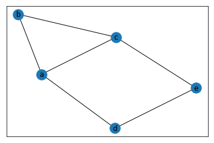

<p align="right"><sup><a href="README.md">Tartalom</a></sup></p>

# Gráfalgoritmusok Pythonban

Ebben a cikkben gráfokkal kapcsolatos közismert algoritmusok példaimplementációiról lesz szó. A cikkhez a következő Python package-eket fogom használni:
- `networkx`
- `numpy`

# Mik a gráfok?

A gráf formális definíciója egy *G(V,E)* pár, ahol *V* a csúcsok véges halmaza, *E* pedig az élek halmaza. Egy él két csúcsból alkotott rendezetlen vagy rendezett pár. Egy gráf élei lehetnek irányítottak vagy irányítatlanok, lehetnek súlyozottak vagy súlyozatlanok. Tehát megkülönböztetjük az alábbiakat:
- irányítatlan, súlyozatlan gráfok
- irányított, súlyozatlan gráfok
- irányítatlan, súlyozott gráfok
- irányított, súlyozott gráfok

A súlyozatlan gráfokat elképzelhetjük úgy, mint a súlyozott gráfok speciális esetét, amikor minden súly 1. Az irányítatlan gráfokat pedig elképzelhetjük úgy, mint az irányított gráfok speciális esetét, amikor minden él mindkét irányban járható.

Amennyiben egy él mindkét végpontja ugyanaz a csúcs, akkor hurokélről beszélünk.

# Gráfok tárolása

Rögtön adódik a kérdés, hogy hogyan érdemes tárolni, ábrázolni egy gráfot. Két általánosan elterjedt ábrázolási módot ismertetek, a szomszédsági mátrixot és az éllistás ábrázolást.

## Szomszédsági mátrix

Vegyük példaként az alábbi, irányítatlan, súlyozatlan gráfot.



A szomszédsági mátrix (adjacencia mátrix, csúcsmátrix) egy olyan, számokból álló táblázat, amelynek annyi sora és oszlopa van, ahány csúcsa van a gráfnak. A példánkban használt gráfnak 5 csúcsa van, ezért a mátrix 5x5-ös. A mátrix i. sorának j. oszlopában szerepel annak az élnek a súlya, amelyik az i. csúcsból a j. csúcsba megy. Ha nincs él az i.-ből a j. csúcsba, akkor a *végtelen* értéket kell használnunk a mátrix elemeként. Súlyozatlan gráfoknál minden elem 0 vagy 1 értékű. Irányítatlan gráfoknál a mátrix szimmetrikus.

A továbbiakban egyszerű gráfokkal dolgozunk, amelyek nem tartalmaznak sem hurokéleket, sem többszörös éleket. Így a mátrix főátlójában mindig 0-k szerepelnek. 

A fenti gráfnak a szomszédsági mátrixa a következőképpen néz ki:


## Éllistás ábrázolás

Ebben az esetben a gráf csúcsai egy listában tároljuk. A lista minden eleméhez hozzárendelünk egy-egy listát: a csúcsból induló élek listáját.

A csúcshoz rendelt lista elemeiben a csúcsból kiinduló élek célcsúcsainak azonosítóját tároljuk. Irányítatlan esetben a célcsúcshoz tartozó listában is eltároljuk az él másik végpontját. Súlyozott esetben a célcsúcsot tartalmazó listaelem tartalmazni fogja az él súlyát is.

A fenti gráf éllistás ánrázolása a következő:


# Gráfok kezelése Pythonban

A Pythonban a gráfok kezelése ebben a cikkben a `networkx` csomagot fogom használni. Ez a csomag összetett hálózatok létrehozását, manipulálását, tanulmányozását teszi lehetővé.

A `networkx` használatához telepíteni kell azt a `pip` segítségével:

```
pip install networkx --upgrade
```

## Gráfok megjelenítése

Az alábbi program a fent vázolt gráfot definiálja majd megjeleníti a `networx` csomag használatával:

```python
import networkx as nx

G=nx.Graph()
G.add_nodes_from(["a", "b", "c", "d", "e"])
G.add_edges_from([("a", "b"), ("b", "c"), ("c", "a"), ("a", "d"), ("c", "e"), ("d", "e")])

nx.draw_networkx(G)
```

## Gráfok él- és csűcsszámának lekérdezése

```python
print("Nodes of graph: {}".format(G.nodes()))
print("Edges of graph: {}".format(G.edges()))
```

```
Nodes of graph: ['a', 'b', 'c', 'd', 'e']
Edges of graph: [('a', 'b'), ('a', 'c'), ('a', 'd'), ('b', 'c'), ('c', 'e'), ('d', 'e')]
```

## Gráfok adjacenciamátrixának elérése

Az adjacenciamátrixot a `to_numpy_matrix()` függvénnyel lehet elérni. (További lehetőségekről a referencia dokumentáció ad tájékoztatást.)

```python
m = nx.to_numpy_matrix(G)
print(m)
```

```
[[0. 1. 1. 1. 0.]
 [1. 0. 1. 0. 0.]
 [1. 1. 0. 0. 1.]
 [1. 0. 0. 0. 1.]
 [0. 0. 1. 1. 0.]]
```

# Gráfbejárás szélességi kereséssel

# Gráfbejárás mélységi kereséssel

# Legrövidebb út kereséses két csúcs között

# Leghosszabb út kereséses két csúcs között

# Referenciák

- [Gráf](https://hu.wikipedia.org/wiki/Gráf)
- [Benjamin Baka: Python Data Structures and Algorithms](https://www.amazon.com/Python-Data-Structures-Algorithms-application-ebook/dp/B01IF7NLM8)
- [Algoritmusok és adatszerkezetek / Gráfok ábrázolása](http://tamop412.elte.hu/tananyagok/algoritmusok/lecke23_lap1.html)
- [networx 2.3 at pypi](https://pypi.org/project/networkx/2.3/)
- [NetworkX Reference Release 2.3](https://networkx.github.io/documentation/stable/_downloads/networkx_reference.pdf)

<p align="right"><sup><a href="README.md">Tartalom</a></sup></p>
