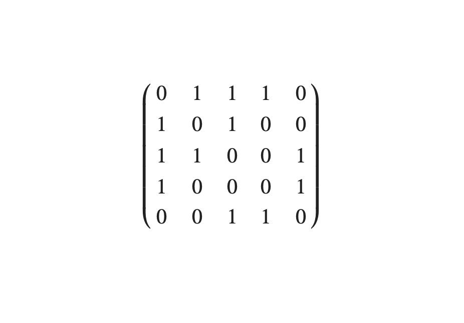

<p align="right"><sup><a href="README.md">Tartalom</a></sup></p>

# Gráfalgoritmusok Pythonban

Ebben a cikkben gráfokkal kapcsolatos közismert algoritmusok példaimplementációiról lesz szó. A cikkhez a következő Python package-eket fogom használni:
- `networkx`
- `numpy`

# Mik a gráfok?

A gráf formális definíciója egy *G(V,E)* pár, ahol *V* a csúcsok véges halmaza, *E* pedig az élek halmaza. Egy él két csúcsból alkotott rendezett pár. Egy gráf élei lehetnek irányítottak vagy irányítatlanok, lehetnek súlyozottak vagy súlyozatlanok. Tehát megkülönböztetjük az alábbiakat:
- irányítatlan, súlyozatlan gráfok
- irányított, súlyozatlan gráfok
- irányítatlan, súlyozott gráfok
- irányított, súlyozott gráfok

A súlyozatlan gráfokat elképzelhetjük úgy, mint a súlyozott gráfok speciális esetét, amikor minden súly 1. Az irányítatlan gráfokat pedig elképzelhetjük úgy, mint az irányított gráfok speciális esetét, amikor minden él mindkét irányban járható.

# Gráfok tárolása

Rögtön adódik a kérdés, hogy hogyan érdemes tárolni, ábrázolni egy gráfot. Két általánosan elterjedt ábrázolási módot ismertetek, a szomszédsági mátrixot és az éllistás ábrázolást.

## Szomszédsági mátrix

Vegyük példaként az alábbi, irányítatlan, súlyozatlan gráfot.


A szomszédsági mátrix egy olyan, számokból álló táblázat, amelynek annyi sora és oszlopa van, ahány csúcsa van a gráfnak. A példánkban használt gráfnak 5 csúcsa van, ezért a mátrix 5x5-ös. A mátrix i. sorának j. oszlopában szerepel annak az élnek a súlya, amelyik az i. csúcsból a j. csúcsba megy. Ha nincs él az i.-ből a j. csúcsba, akkor 0 a mátrix eleme. Súlyozatlan gráfoknál minden elem 0 vagy 1 értékű. Irányítatlan gráfoknál a mátrix szimmetrikus.

A fenti gráfnak a szomszédsági mátrixa a következőképpen néz ki:



## Éllistás ábrázolás

# Gráfok kezelése Pythonban

A Pythonban a gráfok kezelése ebben a cikkben a `networkx` csomagot fogom használni.

## Gráfok megjelenítése

## Gráfok adjacenciamátrixának elérése

```
[[0. 1. 1. 1. 0.]
 [1. 0. 1. 0. 0.]
 [1. 1. 0. 0. 1.]
 [1. 0. 0. 0. 1.]
 [0. 0. 1. 1. 0.]]
```

# Gráfbejárás szélességi kereséssel

# Gráfbejárás mélységi kereséssel

# Legrövidebb út kereséses két csúcs között

# Leghosszabb út kereséses két csúcs között

# Referenciák

- [Gráf](https://hu.wikipedia.org/wiki/Gráf)
- [Benjamin Baka: Python Data Structures and Algorithms](https://www.amazon.com/Python-Data-Structures-Algorithms-application-ebook/dp/B01IF7NLM8)
- [Algoritmusok és adatszerkezetek / Gráfok ábrázolása](http://tamop412.elte.hu/tananyagok/algoritmusok/lecke23_lap1.html)

<p align="right"><sup><a href="README.md">Tartalom</a></sup></p>
